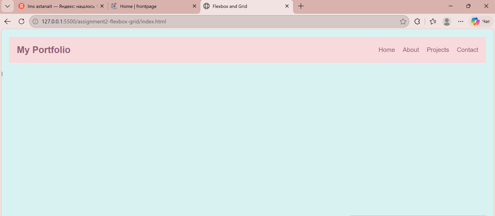
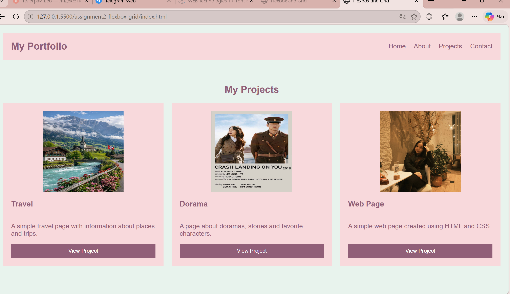
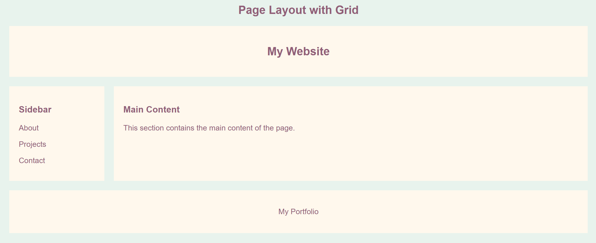
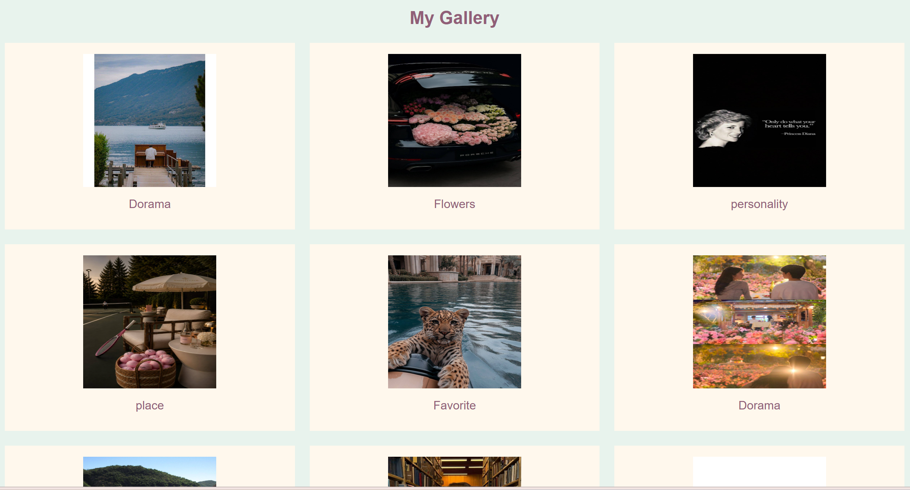

# Advanced CSS: Flexbox & Grid

**Name:** Aidana Muratova
**Group:** SE-2539

## About the Assignment

This assignment is about using CSS Flexbox and CSS Grid to create different types of web layouts.

For this project, I created one webpage and added all four parts of the assignment to it. I used Flexbox for navigation and cards, Grid for page layouts and the image gallery, and then combined both technologies in the final portfolio section.

I worked on the page step by step and checked the result in the browser using Live Server.

## Design and Color Choice

For the design, I wanted to make the website look simple, soft, and pleasant.

I chose light colors with a soft green background, pink sections, purple text, and a light cream color for some Grid blocks. I chose these colors because I liked the combination and wanted the website to have a calm and personal style.

The approximate colors I used are:

* Light green: #e8f3ed
* Strawberry cream/pink: #f8d9dc
* Mauve/purple: #915f78
* Light cream: #fff8ed

I also selected the images myself. I used pictures from Pinterest that matched the topics and the colors of my website. I chose different images for the project cards and the gallery so that the page would look more personal and interesting.

## Task 0 — Navigation Bar

For the first task, I created a navigation bar.

The navigation bar contains:

* My Portfolio logo
* Home
* About
* Projects
* Contact

I used Flexbox for the header.

The logo is placed on the left side, while the navigation links are placed on the right side. I used justify-content: space-between to create space between them and align-items: center to align the elements vertically.

I also used gap between the navigation links so that they do not stay too close to each other.

### Screenshot



## Task 1 — Card Row

For Task 1, I created three project cards.

Each card contains:

* an image
* a project title
* a short description
* a button

The projects are:

1. Travel Website
2. Dorama Website
3. Web Design

I used Flexbox to place the cards in one row. I also used flex: 1 for the cards so they can have equal width.

Inside each card, I used Flexbox with a column direction. This allowed me to place the image, title, description, and button vertically.

I used margin-top: auto for the buttons so that the buttons stay at the bottom of the cards even when the text has different lengths.

For the hover effect, I changed the background color of the card when the mouse is placed over it.

### Screenshot



## Task 2 — Page Layout with Grid Areas

For Task 2, I created a page layout using CSS Grid.

The layout contains:

* Header
* Sidebar
* Main Content
* Footer

I used:

```css
display: grid;
```

and created two columns and three rows.

I also used named Grid areas:

```css
grid-template-areas:
    "header header"
    "sidebar main"
    "footer footer";
```

This allowed me to place the header across the top, the sidebar on the left, the main content on the right, and the footer at the bottom.

This task helped me understand the difference between arranging elements with Flexbox and creating a larger page structure with Grid.

### Screenshot



## Task 3 — Image Gallery

For Task 3, I created an image gallery with nine images.

I chose the images myself from Pinterest. I tried to choose pictures that matched the general style and colors of my website.

I used CSS Grid for the gallery.

The gallery has:

* 3 columns
* 9 images
* equal-sized image areas
* gaps between the items
* captions for the images
* a hover effect for the captions

I used:

```css
display: grid;
grid-template-columns: repeat(3, 1fr);
gap: 20px;
```

The gallery helped me practice creating rows and columns with CSS Grid.

I also used position: relative and position: absolute for the image captions. This allowed the captions to be placed over the bottom part of the image.

### Screenshot



## Task 4 — Portfolio

For the final task, I combined Flexbox and CSS Grid in one layout.

The portfolio contains:

* Header
* Navigation
* Projects
* About Me
* Skills
* Footer

I used CSS Grid for the main structure of the portfolio.

The layout has two main columns:

* the projects section on the left
* the information section on the right

I used Grid areas to organize these sections.

For the header navigation, I used Flexbox. The logo is placed on one side and the navigation links on the other side.

I also used Flexbox inside each project card. The image is placed next to the project information, which includes the title, description, and button.

This part shows how Flexbox and Grid can be used together. Grid is useful for the overall page structure, while Flexbox is useful for arranging elements inside individual components.

The footer contains:

© 2026 Aidana's Personal Website

### Screenshot

-portfolio.png)
-portfolio.png)

## Work Process

I started the assignment by creating the basic HTML structure and connecting an external CSS file.

First, I created the navigation bar and practiced using Flexbox. After that, I added three project cards and arranged them in a row.

Then I created the Grid page layout with a header, sidebar, main content, and footer. After understanding the Grid structure, I created the image gallery with nine images.

For the final part, I combined the two technologies. I used Grid for the main portfolio layout and Flexbox for the navigation and project cards.

During the work, I checked the webpage using Live Server in Visual Studio Code. When something did not look right, I changed the CSS properties and checked the result again.

I also chose the website colors and images myself. I wanted the final page to look simple, soft, and different from a completely standard HTML/CSS page.

## What I Learned

During this assignment, I learned how to use Flexbox and CSS Grid for different purposes.

I learned that Flexbox is useful when I need to arrange elements mainly in one direction, for example in a navigation bar or a row of cards.

I also learned that Grid is useful for larger layouts where I need both rows and columns.

The most useful part for me was combining Grid and Flexbox. I understood that I can use Grid for the overall structure of a page and Flexbox inside individual components.

I also practiced using:

* display: flex
* flex-direction
* justify-content
* align-items
* gap
* flex
* display: grid
* grid-template-columns
* grid-template-rows
* grid-template-areas
* grid-area
* position
* :hover

## Technologies and Tools

* HTML
* CSS
* Flexbox
* CSS Grid
* Visual Studio Code
* Live Server
* GitHub

### Live Server

While working on the assignment, I installed the **Live Server** extension in Visual Studio Code. I used it to open my HTML page directly in the browser and see the changes immediately.

It was useful because I could edit the HTML or CSS, save the file, refresh the page, and quickly check how the layout looked. I used Live Server while working on the navigation bar, cards, Grid layout, gallery, and final portfolio.

### Conclusion

This assignment helped me understand how Flexbox and CSS Grid are used to create different web layouts. I practiced using Flexbox for navigation and project cards, and CSS Grid for larger page structures and the image gallery. In the final task, I combined both technologies in one portfolio layout.

I also learned that small CSS properties can change the position, spacing, and appearance of elements significantly. Choosing my own colors and images made the project more personal, and using Live Server helped me check my work during the development process.

Overall, I became more comfortable with creating layouts using Flexbox and Grid and understanding why each layout method is useful.
